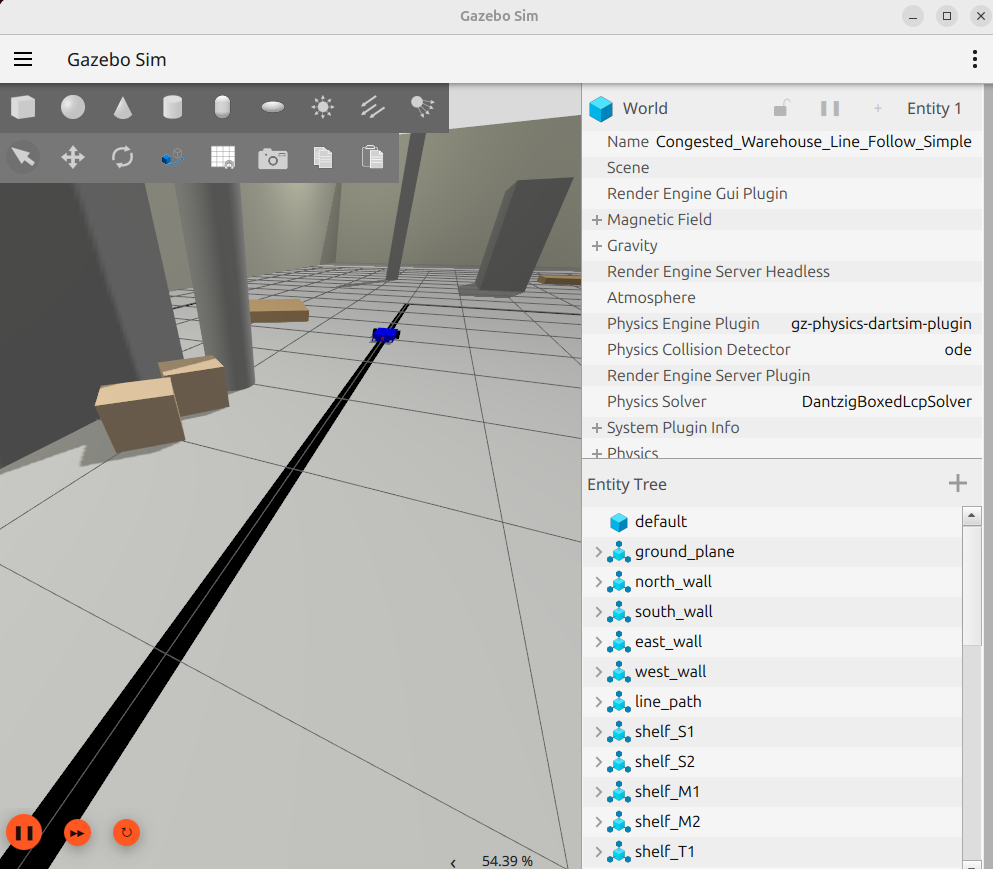

ROS 2 Line Follower Robot in Gazebo Warehouse

This repository contains a ROS 2 package simulating an autonomous line follower robot navigating a congested warehouse environment using Gazebo. The robot employs a PID controller for smooth and accurate line tracking, including recovery behavior for sharp turns.

Author: Bishal Dutta
Email: Bishalduttaoffcial@gmail.com
Website: bishaldutta.tech

Features

ROS 2 Integration: Built using standard ROS 2 (Python) practices.

Gazebo Simulation: Runs within the Gazebo simulator (gz sim) via ros_gz_sim.

Intelligent Line Following: Uses a PID controller (follower.py) for robust line tracking, compensating for proportional, integral, and derivative errors.

Turn Recovery: Implements logic to search for the line after losing it during sharp turns (e.g., 90 degrees).

Stable Robot Model: URDF (robot.urdf) defines a stable 4-wheel robot base to prevent unrealistic pitching during acceleration.

Congested Warehouse World: Custom Gazebo world (warehouse_world.sdf) featuring walls, shelves, boxes, pallets, and pillars to simulate a cluttered environment.

Automatic Start: The robot begins line following immediately upon launch.

Camera Visualization: Automatically launches rqt_image_view to display the robot's camera feed.

Simulation Outcome

(Here you should add your screenshots or ideally an animated GIF showing the robot working!)

Robot navigating the warehouse:

Robot successfully making a turn:

Camera view during operation:

Prerequisites

Ubuntu OS: Ubuntu 22.04 LTS recommended.

ROS 2: ROS 2 Jazzy. Ensure colcon and standard build tools are installed.

Gazebo: Gazebo Garden (or the version compatible with your ROS 2 ros_gz packages, e.g., ros-humble-ros-gz).

Xacro: Ensure the xacro package is installed (sudo apt install ros-<distro>-xacro).

Installation & Building

Clone the Repository:
Navigate to the src directory of your ROS 2 workspace (e.g., ~/ros2_ws/src) and clone this repository:

cd ~/your_ros2_workspace/src
git clone <your_repository_url> .

(Replace <your_repository_url> with the actual URL after you create it on GitHub)

Build the Package:
Navigate back to the root of your workspace and build using colcon:

cd ~/your_ros2_workspace
colcon build --packages-select line_follower_robot

Usage

Source your Workspace:
In a new terminal, navigate to your workspace root and source the setup file:

cd ~/your_ros2_workspace
source install/setup.bash

(Remember to do this in every new terminal you use for this project)

Launch the Simulation:
Run the main launch file:

ros2 launch line_follower_robot line_follow.launch.py

Observe:

Gazebo simulator will open, loading the warehouse world.

The robot will spawn at the start position.

The rqt_image_view window will open, showing the camera feed.

The robot will automatically start following the black line path.

Code Structure

src/line_follower_robot/

config/gz_bridge.yaml: Defines topic bridging between ROS 2 and Gazebo.

launch/line_follow.launch.py: Main launch file to start Gazebo, spawn the robot, run nodes, etc.

line_follower_robot/follower.py: The core Python node implementing the PID line following logic.

urdf/: Contains the robot model files (robot.urdf, camera.xacro, drive.xacro).

worlds/warehouse_world.sdf: The Gazebo world definition file.

package.xml, setup.py, setup.cfg: ROS 2 package definition and build files.

LICENSE: Apache 2.0 License file.

License

This project is licensed under the Apache License 2.0 - see the LICENSE file for details.

Copyright 2025 Bishal Dutta (Bishalduttaoffcial@gmail.com)
Camera Visualization: Automatically launches rqt_image_view to display the robot's camera feed.

