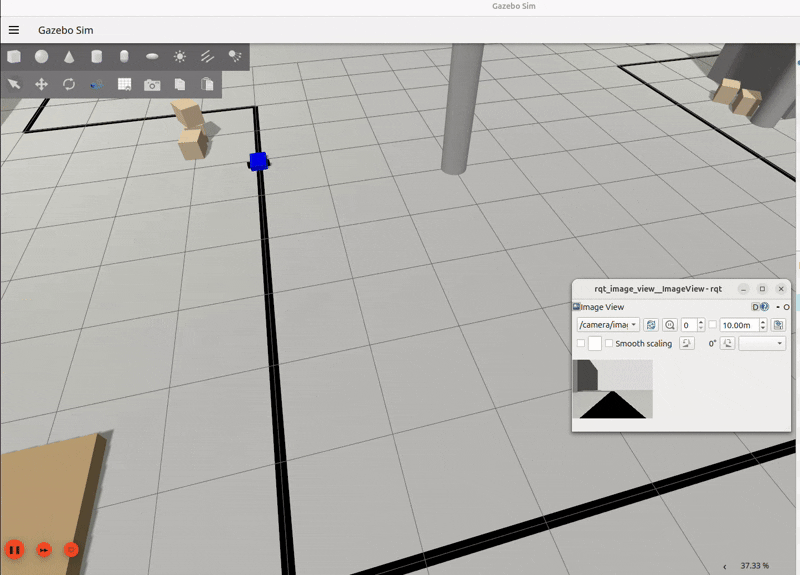
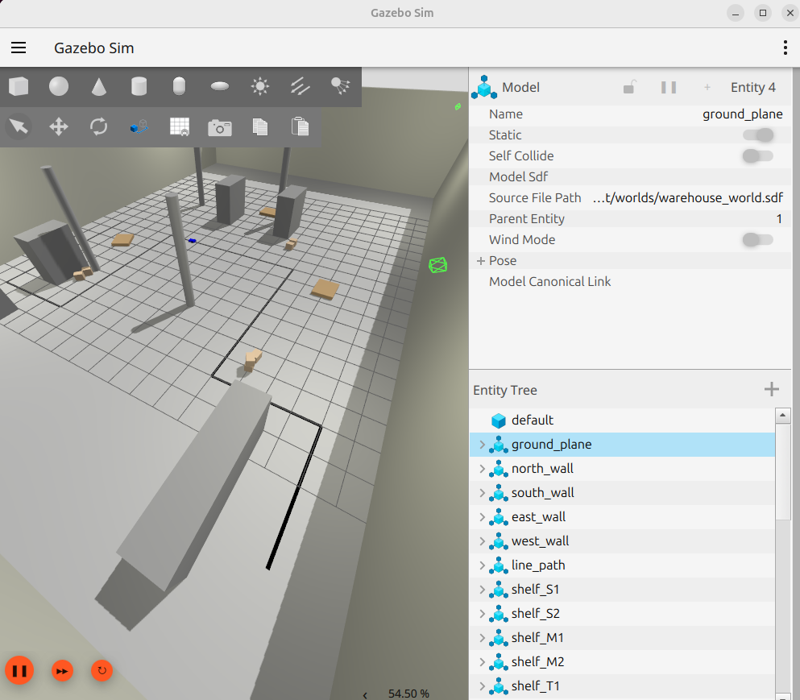
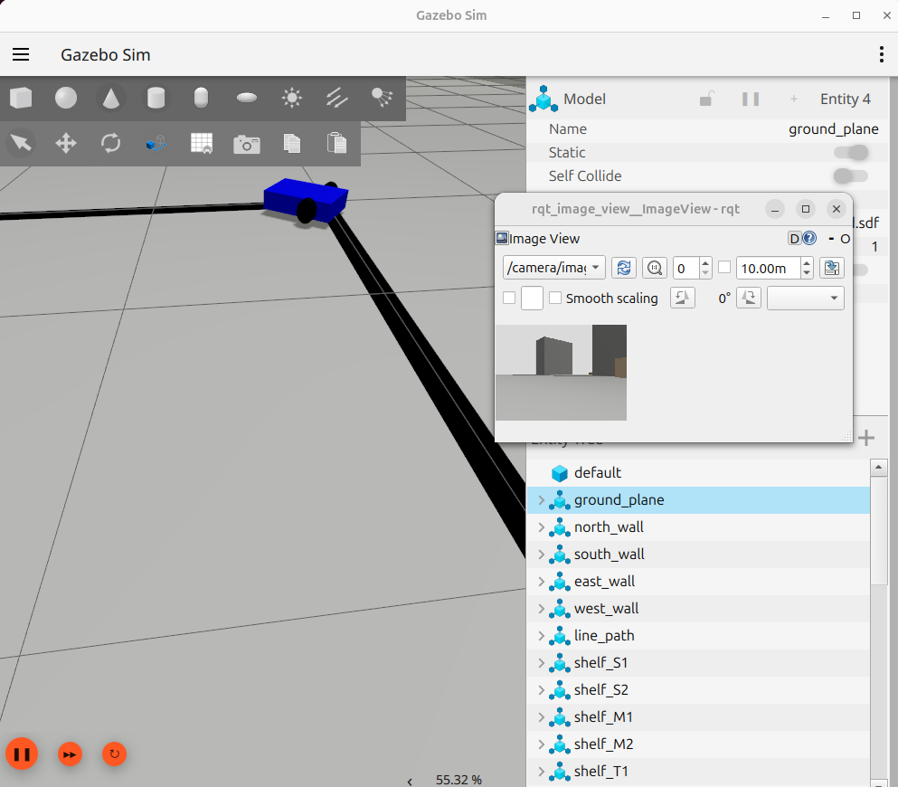

<!--
   ROS 2 Line Follower Robot | Professional README
   Author: Bishal Dutta | 2025
   Website: https://bishaldutta.tech
-->

<h1 align="center">🤖 ROS 2 Line Follower Robot – Gazebo Warehouse Simulation</h1>

<p align="center">
  
</p>

<p align="center">
  <a href="https://ros.org/"></a>
  <a href="https://gazebosim.org/"></a>
  <a href="LICENSE"></a>
  
</p>

---

### 🧭 Overview

An advanced **ROS 2-based autonomous line follower robot** simulation built in **Gazebo**, designed to navigate a **realistic, congested warehouse** environment.  
The robot uses a **camera sensor**, **PID control**, and **recovery logic** to follow black floor lines through narrow aisles and sharp turns—emulating industrial AGV (Automated Guided Vehicle) behavior.

Built for **researchers, students, and developers** exploring **robot control, vision, and simulation in ROS 2**.

---

## 🧠 Key Capabilities

- ⚙️ **ROS 2 Integration:** Fully modular, using publishers/subscribers, launch files, and Gazebo bridges  
- 🧩 **PID Line Control:** Smooth velocity control based on camera feedback  
- 🔄 **Auto-Recovery Logic:** Handles line loss during 90° turns or visual occlusion  
- 🦾 **Stable Kinematics:** Balanced URDF robot with realistic inertia, mass, and wheelbase  
- 🏭 **Custom Warehouse World:** Walls, racks, boxes, and pallets for real-world complexity  
- 📷 **Live Camera Feed:** Visual feedback via `rqt_image_view`  
- 🧠 **Autonomous Start:** Robot initiates line following automatically upon launch  

---

## 🎥 Demonstration

| Warehouse Navigation | Full Workspace view | Turn Recovery |
|:--------------------:|:------------:|:-------------:|
|  |  |  |

---

## 🧩 System Overview

```bash
line_follower_robot/
├── config/
│   └── gz_bridge.yaml              # ROS 2 ↔ Gazebo topic bridge definitions
├── launch/
│   └── line_follow.launch.py       # Main simulation launcher
├── line_follower_robot/
│   └── follower.py                 # PID controller & vision logic
├── urdf/
│   ├── robot.urdf                  # Robot model
│   ├── camera.xacro                # Camera sensor module
│   └── drive.xacro                 # Differential drive base
├── worlds/
│   └── warehouse_world.sdf         # Realistic warehouse environment
├── images/
│   ├── LFR_1.png
│   ├── LFR_nav.gif
│   └── LFR_turn.gif
├── package.xml
├── setup.py
├── setup.cfg
└── README.md

## 🎥  Demonstration

| Topic               | Message Type          | Description                             |
| ------------------- | --------------------- | --------------------------------------- |
| `/camera/image_raw` | `sensor_msgs/Image`   | RGB feed from front camera              |
| `/cmd_vel`          | `geometry_msgs/Twist` | Velocity commands to differential drive |
| `/odom`             | `nav_msgs/Odometry`   | Odometry data for localization          |
| `/clock`            | `rosgraph_msgs/Clock` | Simulation clock from Gazebo            |
